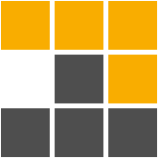

# Hi 👋 I am Anup Rawal

### Full Stack Web Developer | Web Designer

I'm a Full Stack Web Developer with expertise in developing scalable web applications using technologies such as React, Node.js, Express, MongoDB, Laravel, and MySQL.

I'm passionate about building user-centric, efficient, and responsive web applications that solve real-world problems. Let's collaborate and build something awesome together!

- 🌍 I am based in Kathmandu, Nepal
- 📧 You can contact me at [rwlanup@gmail.com](mailto:rwlanup@gmail.com)
- ⚡ Help business dive into digital world

---

### Skills

#### Programming Language

#### Frontend Development

#### Backend Development and Database

#### Software and Tools

### Find me on web

### Hobbies

- Learning new technology
- Listening to music
- Travelling places
- Solving puzzles

### Technology I want to learn

- [Three.js](https://threejs.org/)
- [GSAP](https://greensock.com/gsap/)
- [Python](https://www.python.org/)
- [Django](https://www.djangoproject.com/)
- [Nest.js](https://nestjs.com/)
- [Amazon Web Services](https://aws.amazon.com/)
